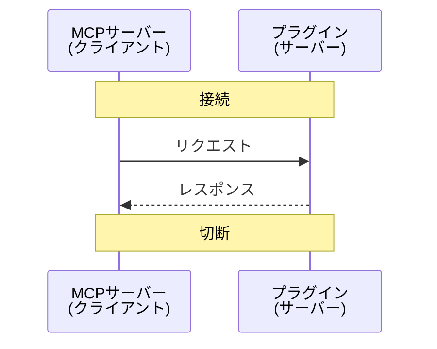

# プラグインとMCPサーバー間のプロトコル

## 概要

プラグインとMCPサーバー間は名前付きパイプで通信する。
プラグインをサーバー、MCPサーバーをクライアントとする。
パイプ名は `\\.\pipe\aviutl_mcp_pipe` を使用する。

通信の流れとしては以下を繰り返す。

1. 名前付きパイプの接続確立
2. クライアントからリクエストを送信
3. サーバーからレスポンスを送信
4. 名前付きパイプの接続解除



## メッセージ

リクエストおよびレスポンスでは以下の内容を送受信する。

| 長さ (byte) | 説明                             |
| ----------: | -------------------------------- |
|           4 | メッセージの長さ $N$ (byte)      |
|         $N$ | メッセージ本文 (JSON, Shift-JIS) |

### リクエスト

リクエストのメッセージ本文の例を以下に示す。
読みやすさのためにインデントしているが、実際の通信時にはインデントや改行は省略する。

```json
{
    "id": 1,                        // リクエストID
    "method": "get_project_info"    // プラグインで実行するメソッド名
}
```

> [!NOTE]
> メソッドの引数をどうやって指定するかは未定。JSON-RPCを参考にするつもり

### レスポンス

レスポンスのメッセージ本文の例を以下に示す。
読みやすさのためにインデントしているが、実際の通信時にはインデントや改行は省略する。

```json
{
    "id": 1,        // レスポンスID、リクエストIDと一致する
    "width": 1920,  // メソッドの結果
    "height": 1080  // メソッドの結果
}
```

> [!NOTE]
> JSON-RPC のように結果を `result` フィールドにまとめた方がよさそう
